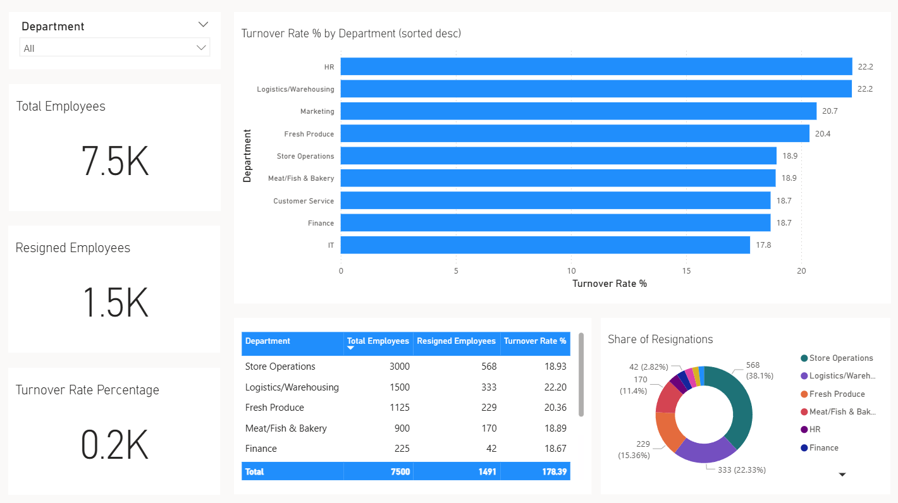

# Employee Performance Analytics Pipeline

This project implements a data pipeline to analyze employee performance, satisfaction, financials, management, and operations data from 2022–2024. The pipeline processes raw HR data into analytical datasets that answer key workforce questions and support business decision making.

## Pipeline Overview

1. **Staging Layer:**  
   Raw data from multiple sources is processed, cleaned, and staged—ensuring consistency, type casting, and normalization.  
   (See: `staging_pipeline.py`)

2. **Analytics Layer:**  
   The staged data is transformed into fact and dimension tables. Analytical views are created to answer business questions such as turnover rates, salary breakdowns, performance trends, managerial effectiveness, training impact, and promotions.  
   (See: `analytics_pipeline.py`)

3. **Output:**  
   Analytical tables are exported for visualization and reporting in BI tools.

## Using Power BI for Visualization

Power BI is used as the Business Intelligence tool to visualize and explore the analytical tables generated by the pipeline.

- Import the processed CSVs or tables into Power BI.
- Example dashboards are shown in the `bi/` folder.

**Included Power BI Visualizations:**

- Turnover rates by department
  

- Salary distribution by job level and department
- Performance trends by month
- Top managers and team performance
- Training vs. performance relationship
- Store revenue comparisons
- Employee satisfaction by department
- Productivity by job role
- Promotion likelihood indicators
- Age vs. performance analysis
